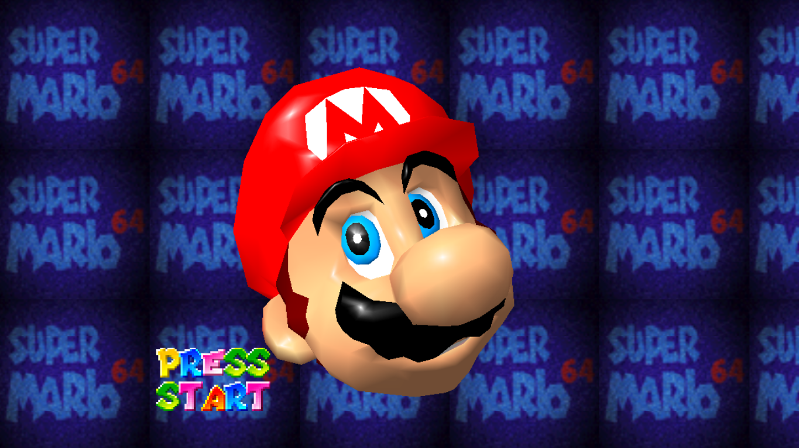
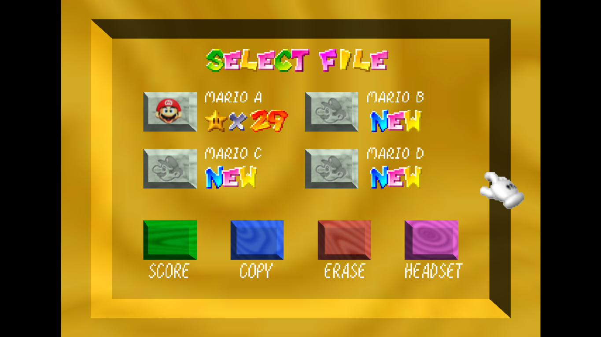
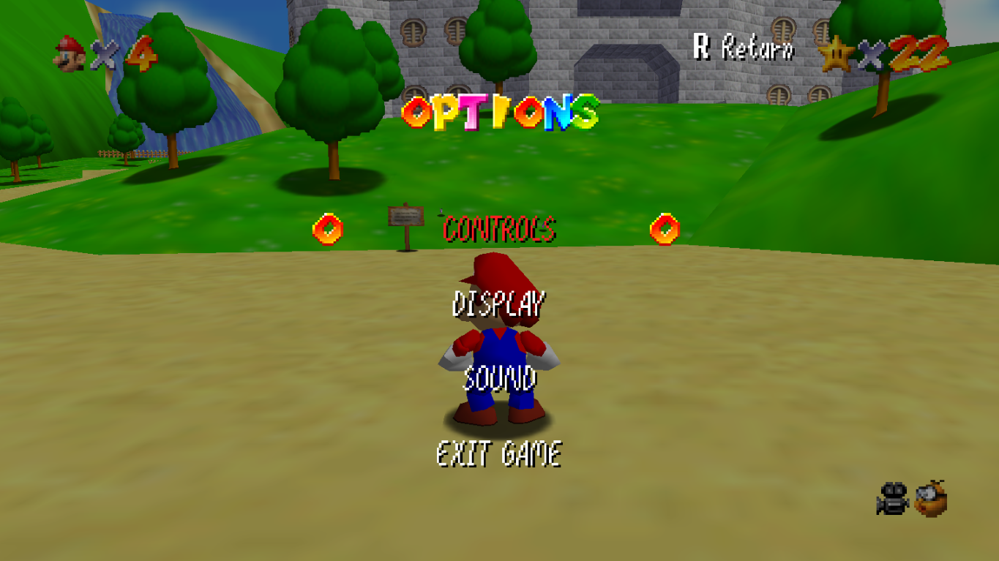

# SM64 (PC Port) Web

    Enjoy this super cool port I guess

PC Port in the Web, this took a while to get, 
Nintendo please don't sue me😬

Enjoy it while you can, probably lmao

This one has more features than the dodo websites you see from other people, 

I got the source from this guy
https://augustberchelmann.com/mario/

I changed it a bit

