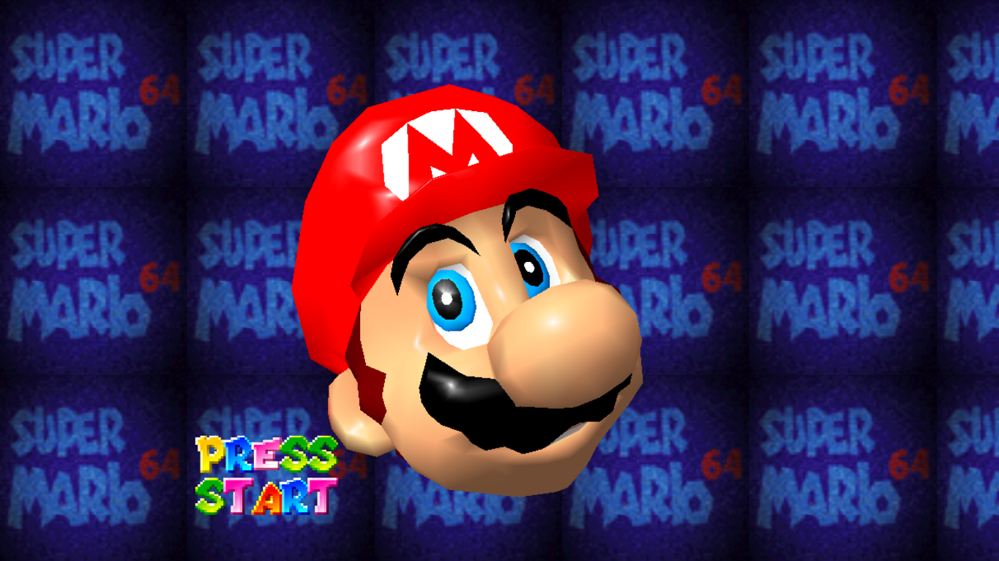
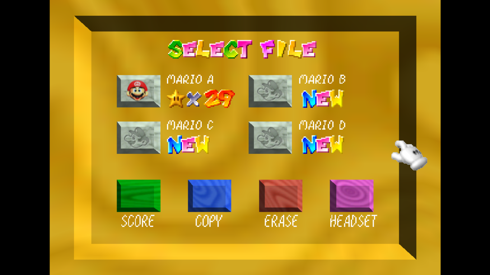
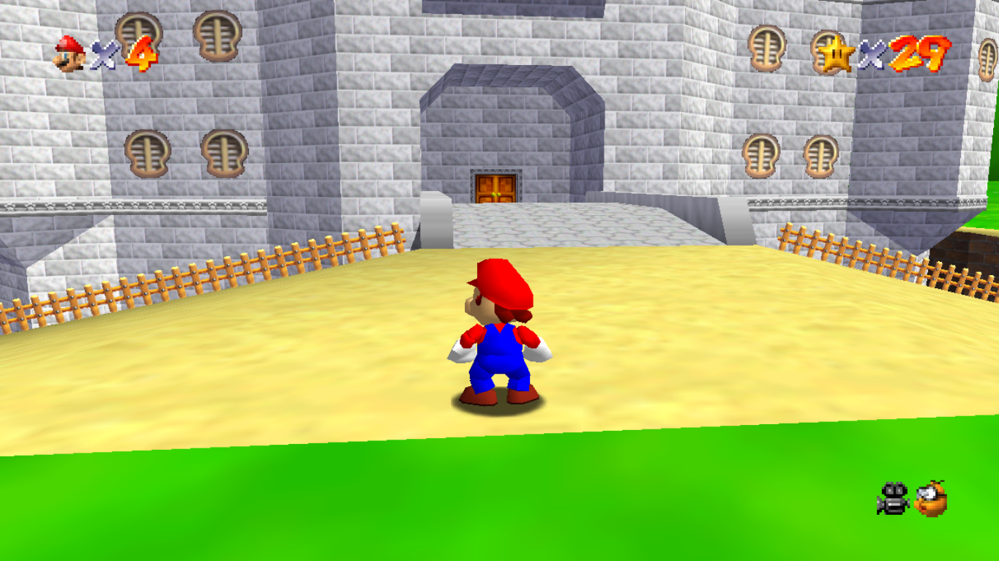
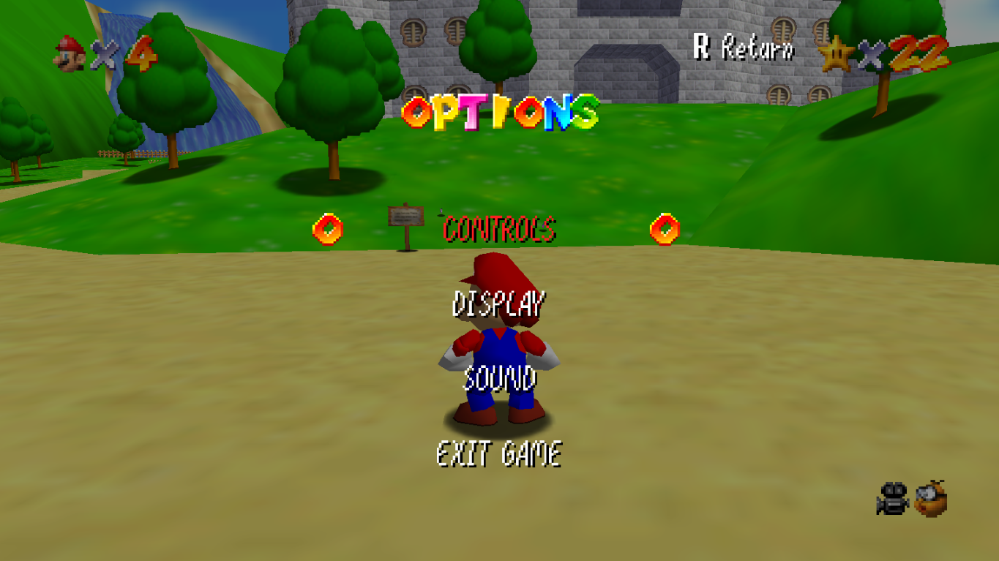

# Super Mario 64 PC Port for the Web

A browser-based version of the Super Mario 64 PC port, with keyboard, gamepad,
and optional touch controls.

## Play

Open the site in a modern browser that supports WebAssembly and WebGL. The
project is deployed with GitHub Pages. To run it locally, serve the repository
root over HTTP rather than opening `index.html` directly:

```sh
python3 -m http.server 8000
```

Then visit <http://localhost:8000>.

## Controls

| Action | Keyboard |
| --- | --- |
| Move | W, A, S, D |
| Jump (A) | L |
| Attack (B) | Comma (`,`) |
| Crouch (Z) | K |
| Camera (R) | Shift |
| Start | Space |
| C-buttons | Arrow keys |

Connect a gamepad to play with a controller. On mobile, touch controls appear
automatically; on desktop, use **toggle touch** to show or hide them. The touch
layout can be repositioned with the edit control.

## Saves

The game stores save data in your browser. Use **backup save** to download a
copy or **load save** to import a 512-byte save file. Browser storage is local
to the browser and device, so export a backup before clearing site data.

## Screenshots

| Main menu | Other menu |
| --- | --- |
|  |  |

| Gameplay | Options |
| --- | --- |
|  |  |

## Credits

This project is based on the web port by
[August Berchelmann](https://augustberchelmann.com/mario/), with modifications
and additional browser controls.
